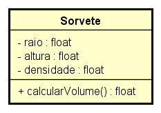
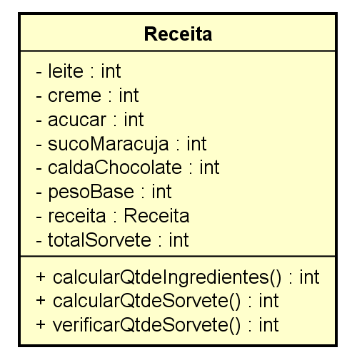
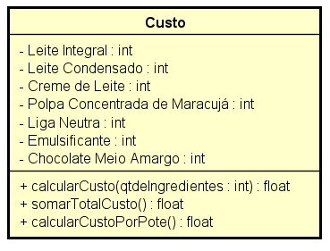
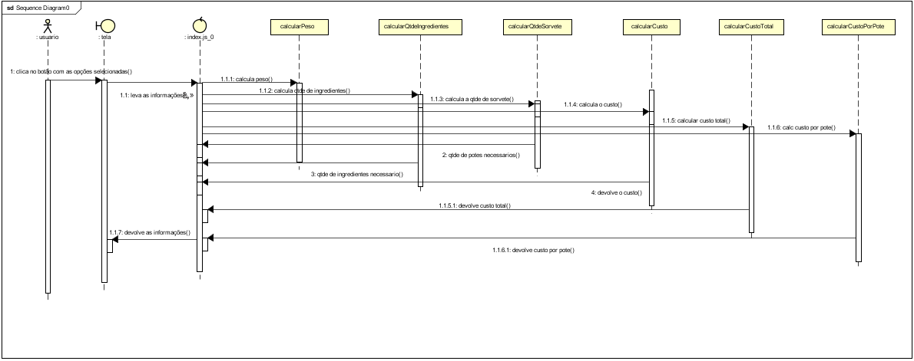
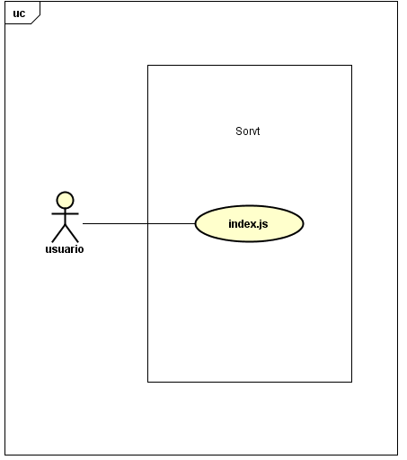
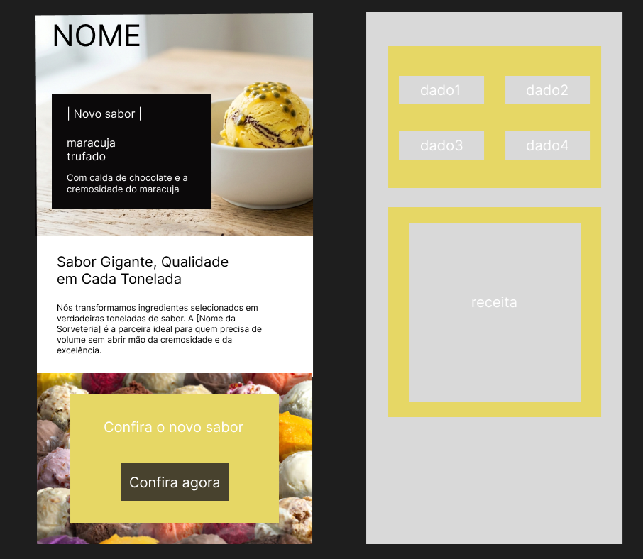

# 🍦 Sorvt™ — Fábrica 4.0

> **Sistema de Controle de Produção Industrial para Sorvetes Artesanais**

---

## 1. Identificação do Projeto

### Título do Projeto
**Sorvt™ — Gelato Geométrico: Fábrica 4.0**

### Identificação da Equipe

| Membro | Função |
|--------|--------|
| _(Matheus Steingraber)_ | Scrum Master    |
| _(Henrique Justus )_    | Front End       |
| _(Fabio Trevisan)_ | Desenvolvimento das classes  |
| _(Juan Saragoza)_  | Desenvolvimento do Index     |


## 2. Visão Geral do Sistema

### Descrição

O **Sorvt™** é um Progressive Web App (PWA) desenvolvido como o **"Cérebro da Fábrica"** de uma sorveteria artesanal em transição para o modelo industrial 4.0. O sistema permite que o mestre sorveteiro e o gerente de produção calculem, de forma rápida e precisa, todos os parâmetros necessários para a produção em escala — desde o volume físico de cada pote cilíndrico até o custo da última grama de ingrediente.

### Objetivo

O aplicativo tem três finalidades principais:

1. **Cálculo de Volume de Potes Cilíndricos** — Dada a densidade do sorvete e o peso líquido do pote (400g, 900g ou 1700g), o sistema calcula automaticamente o volume que o produto ocupa no freezer, fundamental para o planejamento logístico.

2. **Escalonamento de Receitas para Escala Industrial** — A partir de uma receita-base artesanal de 910g, o sistema escala proporcionalmente os ingredientes para lotes de **1 tonelada**, **5 toneladas** ou **12 toneladas**, garantindo a precisão de cada componente e evitando desperdício.

3. **Análise de Custos de Produção** — Com base em preços de mercado reais por kg/litro, o sistema calcula o custo total de ingredientes para o lote escolhido e o custo unitário por pote, fornecendo a base para a definição do preço de venda.

---

## 3. Especificações Técnicas — ISO 25010

### Tecnologias Utilizadas

| Tecnologia | Versão | Finalidade |
|------------|--------|------------|
| **HTML5** | — | Estrutura das telas |
| **CSS3** | — | Estilização e layout responsivo |
| **JavaScript (ESM)** | ES Modules | Lógica de negócio e interatividade |
| **Node.js** | LTS | Ambiente de execução para testes |
| **Jest** | ^30.3.0 | Testes unitários das classes |
| **Babel** | ^7.29.0 | Transpilação para compatibilidade com Jest |
| **Vite** | ^8.0.3 | Servidor de desenvolvimento local |

### Resolução Alvo

O layout foi projetado exclusivamente para **iPhone 14**, respeitando a resolução de referência:

```
Largura:  390 px
Altura:   844 px
```

Todos os elementos (inputs, botões, tabelas de resultado) foram validados para serem completamente visíveis e operáveis dentro desta viewport, sem cortes ou overflow indesejado.

### Modelo de Densidade — 0.6 g/cm³

O sorvete é um produto com **ar incorporado** durante o processo de produção (overrun). Isso significa que seu volume físico é significativamente maior do que o volume que a mesma massa de ingredientes líquidos ocuparia.

A constante de **densidade 0.6 g/cm³** é utilizada obrigatoriamente em todos os cálculos volumétricos do sistema (Regra de Negócio **RN01**), conforme a fórmula:

```
Volume (cm³) = Peso (g) / Densidade (g/cm³)
Volume (cm³) = Peso (g) / 0.6
```

Isso garante que o planejamento de freezer, transporte e armazenamento seja feito com base no **espaço real** que o produto ocupa, e não apenas em seu peso líquido declarado na embalagem.

---

## 4. Modelagem e Design

### Diagrama de Classes (UML)

O sistema é estruturado em três classes principais:

**Classe `Sorvetes`**



**Classe `Receita`**



**Classe `Custo`**



---

### Diagrama de Sequencia (UML)



---

### Diagrama de Caso de Uso (UML)



---

### Protótipo Wireframe (Figma)




### 2. Instalar as Dependências

```bash
npm install
```

Este comando instala todas as dependências listadas no `package.json`, incluindo Jest, Babel e Vite.

### 3. Executar os Testes Unitários

```bash
npm test
```

O Jest executará todos os arquivos `.test.js` dentro da pasta `__test__/` e exibirá o relatório de cobertura no terminal. Todos os testes devem estar com status **PASS** (verde) antes de qualquer deploy.

### 4. Executar o Projeto Localmente

**Opção A — Vite (recomendado):**
```bash
npx vite
```
Acesse `http://localhost:5173` no navegador.

**Opção B — Abrir diretamente:**

Abra o arquivo `index.html` diretamente no navegador. Por se tratar de ES Modules, pode ser necessário um servidor local (o Vite resolve isso automaticamente).

### 5. Sistema em Produção (Vercel)

```
🔗 https://sorvetes-three.vercel.app
```

---

## 6. Cobertura de Testes

O projeto adota a filosofia de **100% de cobertura** nos métodos das três classes de negócio (`Sorvete`, `Receita`, `Custo`), conforme exigido pelo requisito **RNF04**.

### O que foi testado

| Classe | Teste | Regra Validada |
|--------|-------|---------------|
| `Sorvetes` | Armazenamento correto de `peso` e `densidade` | RN01 |
| `Sorvetes` | Atribuição de `altura` por tamanho de pote (400g→15cm, 900g→17cm, 1700g→20cm) | RF01 |
| `Sorvetes` | `calcularVolume()` retorna `peso / 0.6` corretamente | RN01 |
| `Receita` | `pesoBase` calculado corretamente com valores padrão (910g) | RN03 |
| `Receita` | `pesoBase` calculado com valores personalizados | RN03 |
| `Receita` | `calcularQtdeIngredientes()` escala para 1 tonelada com fator correto | RN03 |
| `Receita` | `calcularQtdeSorvetes()` usa `Math.floor` (sem meios potes) | RN02 |
| `Receita` | `calcularQtdeSorvetes(0)` retorna 0 para peso inválido | RNF05 |
| `Receita` | Resultado armazenado em `totalSorvetes` após cálculo | RN02 |
| `Custo` | Inicialização com preços padrão do mercado | RF04 |
| `Custo` | Inicialização com preços personalizados | RF04 |
| `Custo` | `totalCusto` inicializa como 0 | RN04 |
| `Custo` | `calcularCustoPorPote(0)` e `(-1)` retornam 0 | RNF05 |

### Print dos Testes (Jest — Terminal)

> 💡 Insira aqui a captura de tela do terminal exibindo todos os testes em **PASS**.

Exemplo do resultado esperado:

```
 PASS  __test__/Sorvete.test.js
 PASS  __test__/Receita.test.js
 PASS  __test__/Custo.test.js

Test Suites: 3 passed, 3 total
Tests:       13 passed, 13 total
Snapshots:   0 total
Time:        ~0.8s
Ran all test suites.
```

---

## 7. Regras de Negócio Implementadas

### RN01 — Cálculo do Volume Cilíndrico

O volume de um pote cilíndrico é calculado a partir do peso líquido e da constante de densidade do sorvete:

```
Volume (cm³) = Peso (g) / Densidade (g/cm³)
Volume (cm³) = Peso (g) / 0.6

Raio (cm) = √( Volume / (π × Altura) )
```

**Exemplo:** Pote de 900g → Volume = 900 / 0.6 = **1500 cm³**

---

### RN02 — Arredondamento de Potes (Math.floor)

A quantidade de potes produzidos é sempre arredondada para **baixo** (inteiro inferior), pois não são aceitos potes incompletos. A massa excedente retorna ao tanque de produção.

```javascript
totalPotes = Math.floor(massaTotal / pesoUnitarioPote)
```

**Exemplo:** 1.000.000g / 900g = 1111,11... → **1111 potes**

---

### RN03 — Escalonamento para 1, 5 e 12 Toneladas

A receita-base artesanal (pesoBase = 910g) é escalada por um fator proporcional para atingir a meta de produção. O sistema trabalha internamente com a base de **1 tonelada (1.000.000g)** e aplica o fator de tonelagem na camada de apresentação:

```
Fator de Escala = 1.000.000 / pesoBase
Ingrediente Escalado (g) = Ingrediente Base (g) × Fator
```

Para 5 ou 12 toneladas, o resultado de 1 tonelada é multiplicado pelo fator correspondente (`fatorTon = 1 | 5 | 12`).

---

### RN04 — Precisão Financeira

Todos os valores de custo são exibidos com **duas casas decimais** usando `.toFixed(2)`, garantindo a precisão necessária para negociação e precificação industrial.

**Preços de referência utilizados (R$/kg ou R$/L):**

| Ingrediente | Preço Unitário |
|-------------|----------------|
| Leite | R$ 4,50 / L |
| Creme de Leite | R$ 22,00 / kg |
| Açúcar | R$ 4,89 / kg |
| Suco de Maracujá | R$ 15,00 / L |
| Calda de Chocolate | R$ 25,00 / kg |

---

## Estrutura de Arquivos

```
Sorvetes/
├── index.html              # Landing page (Maracujá Trufado)
├── sorvetes.html           # Tela principal do calculador
├── index.css               # Estilos globais (responsivo iPhone 14)
├── index.js                # Controller principal (ESM)
├── models/
│   ├── Sorvete.js          # Classe: volume e raio do pote
│   ├── Receita.js          # Classe: escalonamento de ingredientes
│   └── Custo.js            # Classe: cálculo de custos
├── __test__/
│   ├── Sorvete.test.js     # Testes unitários - Sorvete
│   ├── Receita.test.js     # Testes unitários - Receita
│   └── Custo.test.js       # Testes unitários - Custo
├── diagramas_UML/
│   ├── diagramaSorvete.png
│   ├── diagramaReceita.png
│   └── diagramaCusto.png
├── img/
│   ├── sorvete.jpg
│   ├── sorvete2.jpg
│   ├── sorvt_logo.png
│   └── wireframe.png
├── package.json
├── babel.config.cjs
└── jest.config.mjs
```

---

<p align="center">
  <strong>Sorvt™ — Fábrica 4.0</strong><br>
  Desenvolvido com 🍦 e JavaScript ES Modules<br>
  <em>Todos os direitos reservados</em>
</p>